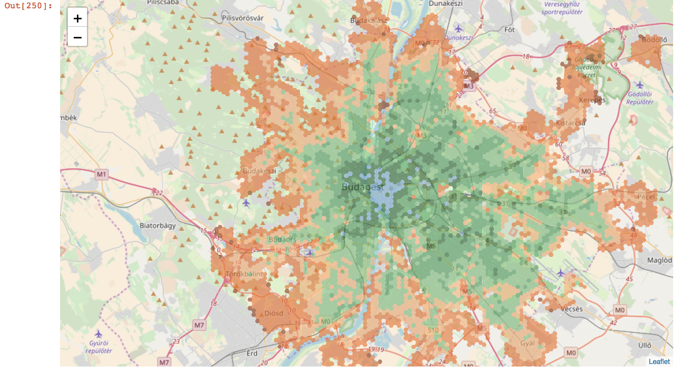

# public-transport-analysis
Urban Public transport analysis.
This repository contains a jupyter notebook and all the related libraries to perform some of the analysis shown  in the <a href="http://citychrone.org" target="_blank">CityChrone platform</a> and compute the data nedeed to add new city in the CityChrone platform.

Take a look at the <a href="http://nbviewer.jupyter.org/github/ocadni/public-transport-analysis/blob/master/public-transport-city.ipynb" target="_blank">demo</a> of the notebook for the city of Budapest.



## Prerequisites
1. [python 3.x](https://www.python.org/download/releases/3.0/)
1. [jupyter](http://jupyter.org/)
1. [MongoDB](https://www.mongodb.com/download-center#community) with the privileges to create and modified a database.
1. An [osrm-backend](https://github.com/Project-OSRM/osrm-backend) server for computing the walking path.
1. All the python library needed, listed at the beginning of the notebook.
### Optional
For computing the "Sociality Score" the population distribution in the city is nedeed. The population distribution can be download for instance from [SEDAC](http://sedac.ciesin.columbia.edu/data/collection/gpw-v4) or for Europe form [EUROSTAT](http://ec.europa.eu/eurostat/statistics-explained/index.php/Population_grids). The public-transport-analysis notebook automatically project the population in a specific tesselletion to the hexagons tesselletions used. The population in each hexagons will be the sum of the population of the overlapping sections proportional to overlapping area.
The population must be stored in a mongodb collections, where each element is a Future of [geojson](https://docs.mongodb.com/manual/reference/geojson/) and in the field "geometry" there should be the a Polygon geometry of the corresponding section. Then the value of the population must be stored in the sub-field of the "properties" field of the element.

## installation
1. clone the repository.
1. Download [openstreetmap](openstreetmap.org) extract (the .pbf file) of the city/region of interest. ->[repository of osm extract: [geofabrik](http://download.geofabrik.de/)).
1. Save the extract in the folder "osrm" of the current repository. Run on the terminal in osrm folder (Compile the street graph and run the osrm backend):
	1. ```osrm-extract -p ./profiles/foot.lua budapest_hungary.osm.pbf```
	1. ```osrm-contract budapest_hungary.osm.pbf```
	1. ```osrm-routed budapest_hungary.osrm --port 5000```
    
## Compute travel time distances and all the accessbility quantities
1. run ```jupyter-notebook``` and open the public-transport-analysis notebook.
1. Set the variable listed at the start of the notebook:
	1. ```city = 'Budapest' # name of the city```
	2. ```urlMongoDb = "mongodb://localhost:27017/"; # url of the mongodb database```
	3. ```directoryGTFS = './gtfs/'+ city+ '/' # directory of the gtfs files.```
	4. ```day = "20170607" #hhhhmmdd [date validity of gtfs files]```
	5. ```dayName = "wednesday" #name of the corresponding day```
	6. ```urlServerOsrm = 'http://localhost:5000/'; #url of the osrm server of the city```
    \[\Optional -- population collection]
    7. ```urlMongoDbPop = "mongodb://localhost:27017/"; # url of the mongodb database of population data```
    8. ```popDbName = "" #name of the population database```
    9. ```popCollectionName = ""#name of the population collection```
    10. ```popField = ""#the field in the properties field in the elements containing the value of the population```
1. run the cells in the notebook.


