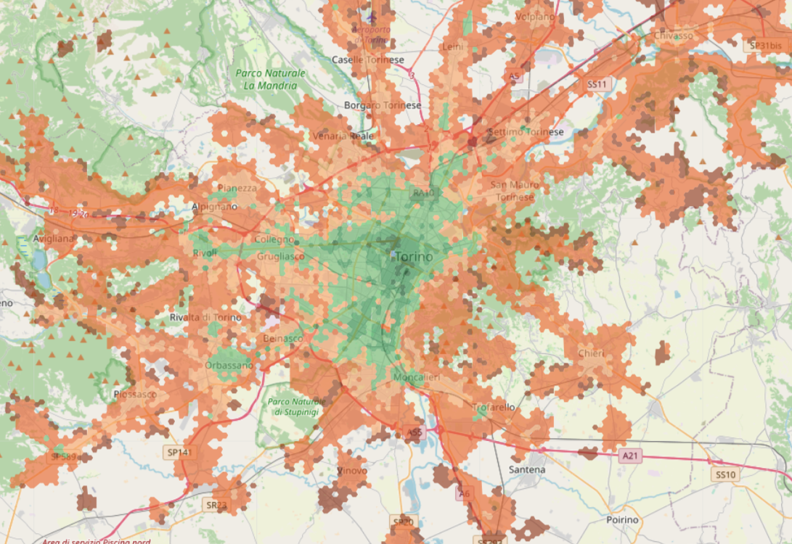

# Public Transport Analysis
Urban Public Transport Analysis.

This repository hosts a Jupyter notebook along with all requisite libraries to conduct analyses similar to those showcased on the [CityChrone platform](http://citychrone.org). It also includes resources necessary to integrate new cities into the CityChrone platform.

Explore the [demo notebook](http://nbviewer.jupyter.org/github/ocadni/public-transport-analysis/blob/master/public_transport_analysis.ipynb) featuring an analysis for the city of Turin.

## Prerequisites
To utilize this repository, ensure you have the following installed:
1. [Python 3.x](https://www.python.org/download/releases/3.0/)
2. [Jupyter](http://jupyter.org/)
3. [MongoDB](https://www.mongodb.com/download-center#community) with privileges to create and modify databases.
5. All Python libraries listed in requirements.txt.

### Optional
For calculating the "Sociality Score", you'll need the city's population distribution. This data can be sourced from [SEDAC](http://sedac.ciesin.columbia.edu/data/collection/gpw-v4) or for Europe, from [EUROSTAT](http://ec.europa.eu/eurostat/statistics-explained/index.php/Population_grids). Our notebook automatically projects the population onto a specified tessellation, summing populations of overlapping sections proportionally to their overlapping areas. The population data must be stored in a MongoDB collection with each element being a Feature of [geojson](https://docs.mongodb.com/manual/reference/geojson/), containing a Polygon geometry in the "geometry" field, and the population value in a sub-field of the "properties" field.

    
## Computing Travel Time Distances and Accessibility Metrics
1. Launch the notebook with `jupyter-notebook` and open the public-transport-analysis notebook.
2. Set the variables listed at the start of the notebook:
    1. `city = 'Turin' # name of the city`
    2. `urlMongoDb = "mongodb://localhost:27017/"; # URL of the MongoDB database`
    3. `directoryGTFS = './gtfs/'+ city+ '/' # directory of the GTFS files`
    4. `day = "20170607" # YYYYMMDD format [date validity of GTFS files]`
    5. `dayName = "wednesday" # name of the corresponding day`
    3. Execute the cells within the notebook.

## Citation
If you utilize this repository for your research, please cite the following paper:

Biazzo Indaco, Monechi Bernardo, and Loreto Vittorio. "General scores for accessibility and inequality measures in urban areas." R. Soc. open sci.6 (2019): 190979. [DOI: 10.1098/rsos.190979](http://doi.org/10.1098/rsos.190979).
